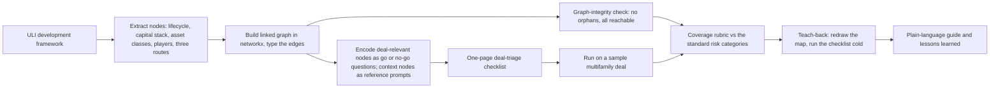

# 01. The Field on One Page: the Real Estate Development Concept Map and Deal-Triage Checklist

> Standalone project record. Researched and compressed from the one catalog source named below, and from that source only. It does not read, depend on, or cross-reference any other production file in this workspace. Everything needed to understand, use, or paste this project into the V2 generator lives in this single file. This is a fresh full ingest at the 0.17.0 contract (workspace 1.13.0).

## Provenance (read-only, the only external link)

- Catalog source: the mastery-real-estate-development catalog, rank 1, "The Development Concept Map" (path in the frontmatter source_spec). The catalog entry names the build (a linked concept map of the field turned into a one-page deal-triage checklist) and its self-check (explain any node cold, and confirm the checklist flags the same risks the framework names).
- Source version at ingest: 1.0.0.
- Why this system: rank 1 in the catalog's do-first order (Wave 1, Foundations and the Development Framework). It is the foundational base the whole path stands on: hold the field as a connected whole before modeling a single deal.
- Ingested fresh 2026-07-12 by Claude Opus 4.8 at the 0.17.0 contract. The dual-eval results are recorded in the cross-eval audit below.
- Isolation rule: the ingest reads the one catalog entry only. After ingest this file stands alone.

## Kickoff (setting the stage)

- The moment: it is day one of the mastery path. The learner-developer has read scattered articles and listened to deal podcasts, but the field is still a fog, the lifecycle, the money, the players, and the product types float as disconnected facts.
- The ask: a mentor-developer sets the first task, and it is a build, not a lecture: "Map the whole field as one connected picture, then turn that picture into a working tool you can run on a real deal. Bring me the map, the checklist run on a sample deal, and a five-minute teach-back."
- The why-now: you cannot underwrite, structure, or site-select anything until you can see how the pieces connect; every later wave hangs off this base, so the map is built first.
- The shape: a full build of a working learning system (a linked concept graph plus a one-page deal-triage checklist run on a sample deal), not a summary of a textbook.
- The definition of done: the map is built and passes its graph and coverage checks, the checklist runs cleanly on a sample deal and raises a flag in each standard risk category, the teach-back passes, and the plain-language guide exists.

## Mastery frame and signature artifact

- Mastery frame (PoV-CI, mastery-real-estate-development): this project proves a piece of subject-matter command by doing. The learner absorbs the field's structure by rebuilding it as a runnable tool, and the tool demonstrably screens a real deal, with a self-check against the field's own framework.
- Signature artifact: the validated learning system plus its concrete self-check plus a teach-back. Here that is the concept map plus the deal-triage checklist, validated by the graph-integrity and node-coverage checks and the sample-deal run, and proven by a teach-back that shows the learner can redraw the map and run the checklist cold.

## Pre-artifacts (design-first)

Design before build. These are produced and validated before the map is built, so the exact learning system is agreed first. They are presentation-grade and written for two audiences: engineering leadership (the technical readout) and stakeholders and customers (the learning readout, clear and instructional). They are not pasted into the generator; R1 names them as build deliverables.

### Architecture Decision Records

- ADR-001. One integrated build, map and checklist together, never two loose deliverables. Context: a concept map and a deal-triage checklist are the same knowledge in two forms, the map makes the structure visible and the checklist turns each node into an action. Choice: one integrated build where the checklist is derived node-by-node from the map. Consequence: no pretty diagram no one uses and no checklist with no reasoning behind it; the two forms validate each other.
- ADR-002. The Urban Land Institute framework is the source of truth for the development nodes. Context: a field map is only trustworthy if it traces to an authority, not to the learner's opinion, but not every node is a framework element. Choice: every development node (the lifecycle stages and the players) traces to the ULI development framework (Miles and colleagues, Real Estate Development: Principles and Process); the risk rubric (the standard development risk types) and the three career routes are the project's own, labeled as such rather than attributed to the framework. Consequence: the coverage self-check has a concrete referent (the framework for development nodes, the project's rubric for risk), so "complete" is testable, not a feeling.
- ADR-003. Encode every deal-relevant node as a thresholded go or no-go question; context nodes become reference prompts. Context: a fact you cannot act on is not yet command of the field, but not every node is a deal gate (the career routes and some players are context, not go/no-go). Choice: each deal-relevant node becomes one screening question carrying a numeric or categorical go or no-go bar, while the context nodes become reference or routing prompts. Consequence: the checklist decides rather than describes, and running it on a sample deal proves the map is a tool, not a diagram.
- ADR-004. Prove it on a sample deal, public or hypothetical only. Context: the map must be tested against a real deal, but this is a study build, not investment activity. Choice: run the checklist on a public or hypothetical multifamily deal with illustrative numbers. Consequence: a securities and advice caveat is load-bearing (no real solicitation, no live terms), and the tool is genuinely exercised.

### End-to-end architecture topology (Mermaid)



### Implementation plan (mapped to the 90-minute build budget)

The operator build budget is 90 minutes (mastery tier); a minimum prototype pass that then deepens over deep-work sessions.

1. Principles and source policy, 0 to 10 min: the agent-building principles, the framework-fidelity list (the eight-stage lifecycle, the capital-stack layers, the asset classes, the players, the three routes, the risk taxonomy), and the study-only and no-advice policy. Output: a fidelity and safety policy.
2. Design-first pre-artifacts, 10 to 22 min: the decision records, the end-to-end topology, and the rubric design. Output: this validated pre-artifact set.
3. Build the map, 22 to 48 min: the node extractors, the edge typers, the graph builder, and the graph-integrity check, in parallel. Output: the linked concept graph that passes the integrity check.
4. Encode and run the checklist, 48 to 68 min: the checklist encoders turn each node into a thresholded question, and the sample-deal runner executes it. Output: the one-page checklist and its sample-deal run.
5. Validate, 68 to 80 min: the coverage rubric against the standard development risk categories, and a teach-back dry run. Output: a proven map and checklist.
6. Documentation and walkthrough, 80 to 90 min: the plain-language guide, the two-audience readout, and the lessons learned. Output: the signature artifact.

### Presentation for two audiences

- Engineering leadership (technical readout): the pipeline that turns a framework into a runnable tool, the typed knowledge graph with its integrity check (no orphans, full reachability), the node-to-question encoder with go or no-go thresholds (deal-relevant nodes only), the coverage rubric against the standard development risk categories, and the sample-deal run as the proof. The message: a foundations map made into a measured instrument, not a poster.
- Stakeholders and customers (learning readout, clear and instructional): in ninety minutes you turn real estate development from a fog of jargon into one connected picture, and you walk out with a one-page checklist that screens a real deal for the risks that matter, plus the ability to teach the whole field cold. The message: the field, the tool, and the proof it works.

### Validation (so it is known to work)

- Working system: the linked concept graph passes the networkx integrity check (no orphan nodes, every node reachable) and contains every lifecycle stage, capital-stack layer, and asset class the framework names.
- Coverage: every deal-relevant node maps to a screening question (context nodes map to reference prompts), and each standard development risk type in the project's risk rubric (market, entitlement, construction, financing, and operations risk) has at least one question that would flag it.
- Proof of the system: run on the public, hypothetical, or anonymized sample deal, the checklist raises at least one flag in each risk-rubric category, and any deal-specific judgment is recorded as the learner's own analysis (not a framework diagnosis); and the teach-back has the learner explain any node cold to a novice, redraw the map from memory, and walk the checklist through the sample deal in five minutes.
- Evidence: the graph-integrity report, the completed coverage rubric, the checklist run on the sample deal, and the teach-back record.

### Delivery rails (GitHub and Linear)

- Repo plan: private repo Pineapple-Systems/red-development-concept-map, created by the build. Mastery signature features: Issues as the build tasks (node extraction, edge typing, checklist encoding, sample-deal run), PRs carrying the graph-integrity and coverage evidence, an Actions workflow that runs the networkx integrity check on every push (no orphans, full reachability) and lints the checklist for a threshold on every question, Releases as mastery milestones (v0.1.0 at the first passed teach-back), and the commit history as the practice record.
- Ticket plan: Linear project "The Field on One Page. Development concept map and deal-triage checklist" in the Pineapple Systems workspace, created by the build. Epics from the build phases: Pre-artifacts (stories: decision records and topology; rubric design); Map build (stories: node extraction from the framework, edge typing, graph build and integrity check, each with acceptance criteria); Checklist and deal run (stories: node-to-question encoding with thresholds, checklist assembly, sample-deal run); Ship, docs, and teach-back (stories: plain-language guide, release, teach-back evidence). Tasks under each story; every ticket carries a definition of done.
- Completion: each ticket is worked on a branch and a PR into main carrying its magic word; the build is done only when its PRs are merged, its tickets are closed, its Linear project is Completed, its release is tagged, and the repo documentation is present.

### Post-artifacts (build outputs)

The build produces these, and R2 names them as deliverables: the linked concept map (nodes and typed edges); the one-page deal-triage checklist (each node a thresholded question); the sample-deal run; the spaced-repetition deck exported from the map; the graph-integrity and coverage evidence and the teach-back record; the presentation of what was built with lessons learned; the shipped private repo with its closed Linear tickets and Completed project as proof-of-work; and the repo documentation (a plain-language guide: what the map is and why, how to rebuild it, how to run the checklist on a deal, and where the deeper material lives).

### Stack currency and flexibility

- The stack named here (a graph-note vault such as Obsidian with its local graph or Logseq for the map, Python with networkx for the graph checks, Mermaid for the topology diagram, and a spreadsheet or plain markdown for the one-page checklist, over the ULI development framework as the source text) is the current default, not a locked list. It is free to run and adapts to whatever graph vault the learner already uses.
- Presentation format (mastery-real-estate-development repo, per the practitioner learning register): a teach-back or learning readout, clear and instructional, with the honest three routes stated.

## Generator payloads

Paste each block into the V2 project generator in order. S0 is the 500-char intake. R1, R2, R3, R4 are the 3600-char refinements. Only these five blocks go into the generator; the frontmatter, the pre-artifacts, and the audit sections are workspace metadata and are not pasted or seen by the generator.

### S0. Summary

<!-- payload: S0 | cap: 500 | chars: 482 -->
```text
The Field on One Page: a foundations build that turns real estate development from a fog of jargon into a connected whole. Starting the mastery path, a learner-developer maps the lifecycle, the players, the capital stack, the asset classes, and the honest three routes as a linked concept graph, then encodes every node as a one-page deal-triage checklist with go or no-go thresholds and runs it on a sample deal. Output: the map, the checklist, a teach-back. Not investment advice.
```

### R1. Architecture refinement

<!-- payload: R1 | cap: 3600 | chars: 3470 -->
```text
The stage is the first day of the mastery path. The learner-developer has read scattered articles and listened to deal podcasts, but the field is still a fog: the lifecycle, the money, the players, and the product types float as disconnected facts. The mentor's ask is not a lecture but a build: map the whole field as one connected picture, then turn that picture into a working tool you can run on a real deal, and teach it back cold.

This is one integrated build, not two loose deliverables. The concept map and the deal-triage checklist are the same knowledge in two forms: the map makes the structure visible, and the checklist turns each node into a decision you can act on. Splitting them would leave a pretty diagram no one uses or a checklist with no reasoning behind it. Deliver this as one end-to-end project; do not split it into smaller projects or strip any part of the scope.

The source of truth is the Urban Land Institute development framework (Miles and colleagues, Real Estate Development: Principles and Process), which names the eight-stage lifecycle and the players. Every development node traces to that framework; the standard development risk types and the honest three routes (the academic real-estate-economics doctorate, the practitioner Master of Real Estate Development plus real deals and the CCIM, and the pure experience route) are the catalog's own risk rubric and career framing, mapped alongside as a first-choice fork and labeled as such, not attributed to the framework, because the field is built on deals more than on any degree.

The build shape is map, then encode, then run. First, script a linked concept graph whose nodes are the lifecycle stages, the capital-stack layers (senior debt, mezzanine, preferred equity, common equity), the asset classes, the players, and the three routes, with typed edges (precedes, funds, bears-the-risk, is-a-kind-of). Second, encode every deal-relevant node as a screening question with a concrete go or no-go threshold, producing a one-page deal-triage checklist, while the context nodes (the career routes and some players) become reference prompts rather than go/no-go gates. Third, run the checklist on a public, hypothetical, or anonymized sample deal (educational screening only) so the tool is proven, not theoretical.

The build is AI-native and agent-built but deliberately modest, because a foundations map does not need a swarm: an orchestrator plus a small roster of agents (about a dozen to twenty: node extractors reading the framework, edge typers, a graph builder, checklist encoders that turn each deal-relevant node into a thresholded question, a sample-deal runner, a teach-back scorer, and a documentation writer) run in parallel with loops and goals. It follows a design-before-build order: agent-building principles first, then the decision records and the topology diagram, then the plan, then the map and the checklist, then a two-audience walkthrough with lessons learned.

The stack is concrete and free to run: a graph-note vault (Obsidian with its local graph, or Logseq) holds the map, Python with networkx builds and checks the graph (no orphan nodes, every node reachable), Mermaid draws the topology, and a spreadsheet or plain markdown holds the one-page checklist. No metered pay-per-token API is used. The voice is a practitioner-learner's: plain, concrete, and honest about what a map can and cannot do. Nothing here is investment, legal, or tax advice.
```

### R2. Deliverables and validation refinement

<!-- payload: R2 | cap: 3600 | chars: 3500 -->
```text
The build produces four classes of deliverable, packaged as one integrated project with separately reviewable artifacts. The core is the knowledge in two forms: the linked concept graph (nodes for the lifecycle stages, the capital-stack layers, the asset classes, the players, and the three routes, with typed edges) and the one-page deal-triage checklist derived from it (every node encoded as a go or no-go screening question with a concrete threshold). The supporting deliverables are the sample-deal run (the checklist executed on a public, hypothetical, or anonymized sample deal, educational screening only), the Mermaid topology diagram, and a spaced-repetition deck exported from the map so the structure stays learned. The validation deliverables are the graph-integrity check, the node-coverage rubric, and the teach-back instrument. The documentation deliverable is a plain-language guide: what the map is and why, how to rebuild it, how to run the checklist on a deal, and where the deeper material lives.

The signature artifact is the validated learning system: the concept map plus the deal-triage checklist, proven by its self-check and a teach-back that shows the learner can redraw it and use it cold.

Validation runs at named bars, and these are the catalog's own self-check made concrete. Graph integrity: the networkx check confirms no orphan nodes and that every lifecycle stage, capital-stack layer, and asset class the framework names is present and connected. Coverage: every deal-relevant node maps to a screening question (context nodes map to reference prompts instead), and each standard development risk type in the project's risk rubric (market, entitlement, construction, financing, and operations risk) has at least one question that would flag it. Deal proof: run on the sample deal, the checklist raises at least one flag in each risk-rubric category, and any deal-specific judgment is recorded as the learner's own analysis, not a framework diagnosis. Teach-back: the learner explains any node cold to a novice, redraws the map from memory, and walks the checklist through the sample deal in five minutes.

The rigor anchor is the framework itself: the Urban Land Institute development text and its eight-stage lifecycle and risk taxonomy are the authority the map is checked against, not the learner's opinion. There is no product-level standard to certify here; the standard is fidelity to the field's own framework.

Two honest caveats apply. The sample deal is public, hypothetical, or anonymized, and every number in it is illustrative, so the checklist is a study and screening tool for educational use only, not an appraisal, an underwriting opinion, an investment decision, or a solicitation to invest. And the three-route fork is guidance on a career choice, not a credential: this build confers the field's structure and a working screen, not a degree, a license, capital, or a track record of closed deals.

The measurable outcome is a completed map that passes the graph and coverage checks, a one-page checklist that runs cleanly on the sample deal, and a passed teach-back. The adoption target, framed as a design goal not yet piloted, is that the learner reuses the checklist unchanged on the next deal they screen for practice within thirty days.

Post-artifacts named as deliverables: the concept map, the deal-triage checklist, the sample-deal run, the spaced-repetition deck, the plain-language guide, and the presentation with lessons learned.
```

### R3. Operations and adoption refinement

<!-- payload: R3 | cap: 3600 | chars: 2961 -->
```text
All the AI work runs through the operator's flat-rate, already-paid clients, never a metered pay-per-token API, so the build carries no per-token bills within the plan's limits. Pick one client: Claude Code or Claude Cowork, Codex through the ChatGPT subscription, Gemini through Google Antigravity, or Cursor, each subscription-based and bundled within its usage limits. Everything else is open source or free: a graph-note vault such as Obsidian or Logseq for the map, Python with networkx for the graph checks, Mermaid for the topology, and a spreadsheet or plain markdown for the checklist. The Urban Land Institute text is the one reference to obtain. The net is no per-token spend within the subscription limits, confirmed in a preflight since plans change.

The build ships through the two standard delivery tools: a private GitHub repo and a Linear project of planned tickets, worked branch-by-branch through pull requests that close tickets as they merge, ending in a tagged release and plain-language repo docs. The tools are fixed; the features used inside them flex to the build.

Three patterns carry the method. Node-to-question encoding: every node on the map must become one screening question with a concrete threshold, because a fact you cannot act on is not yet mastery. Threshold discipline: each question carries a numeric or categorical go or no-go bar (for example a minimum yield-on-cost or a maximum entitlement uncertainty), so the checklist decides rather than describes. Run-it-on-a-sample-deal: the map is only proven when the checklist screens a public, hypothetical, or anonymized sample deal and raises a flag in each risk-rubric category.

Three foundations misreadings are corrected directly. Development is not buying stabilized property; the map keeps the development-specific stages (entitlement, construction, lease-up) that a buy-and-hold view omits. The three routes are not interchangeable; the academic doctorate is for research and teaching, while the practitioner route plus deals is how you learn to develop, and the map names that fork honestly. And a concept map is not a syllabus to read; it is a tool to run, so the deliverable is the checklist in use, not the diagram alone.

On adoption, the map is a launchpad, not a terminus. It stays live through spaced repetition (the exported deck) and, more importantly, through use: the learner runs the checklist on the next deal they screen for practice, and each new deal adds or sharpens a node. By the time the modeling and market waves are built, the map has grown edges into them, so the field that started as a fog is now a connected whole the learner can navigate and teach. The real measure is not a pretty diagram but a screen the learner trusts and reuses, and the honest three routes still hold: this builds the knowledge, the tool, and a portfolio, not a degree, a license, capital, or a track record, and nothing here is investment, legal, or tax advice.
```

### R4. Build checklist and validation refinement

<!-- payload: R4 | cap: 3600 | chars: 3510 -->
```text
Before you finalize, work through this checklist internally and fix any gap in place, then briefly report only the items that needed a fix and what you changed. Do not drift across the whole build, do not hallucinate, do not fabricate, and do not strip or split any scope.

Scope intact: the full build described here is delivered as one project, the linked concept map, the encoded one-page deal-triage checklist, the sample-deal run, the graph and coverage checks, and the teach-back, nothing dropped, nothing broken into smaller or separate projects.

Point of view: it reads as a learner-developer on the first day of the mastery path building the field into a connected whole by doing, clear and concrete, carrying the mentor's build-not-lecture ask and the teach-back as the proof.

Title: the high-impact title and hook (The Field on One Page) are present and carried in the heading and the opener.

Stack and delivery: the concrete current stack is named (a graph-note vault such as Obsidian or Logseq for the map, Python with networkx for the graph checks, Mermaid for the topology, and a spreadsheet or markdown for the checklist), it stays free to run with no metered per-token API, and the build ships through a private GitHub repo and a Linear project of planned tickets closed through pull requests, with a tagged release and plain-language repo docs.

Map and checklist: the development nodes cover the lifecycle stages, the capital-stack layers, the asset classes, and the players with typed edges, and the three routes are mapped as the project's own career framing; every deal-relevant node is encoded as one screening question with a concrete go or no-go threshold while context nodes are reference prompts; and the checklist runs cleanly on the sample deal and raises a flag in each risk-rubric category, with any deal-specific judgment recorded as the learner's analysis.

Pre-artifacts and post-artifacts: the design-first artifacts are created and consistent (the decision records, the topology diagram, the plan, the two-audience readout, the named validation), and the build outputs are created and named (the map, the checklist, the sample-deal run, the spaced-repetition deck, the plain-language guide, and the presentation with lessons learned).

Documentation: the build ships with a plain-language guide as a named output, what the map is and why, how to rebuild it, how to run the checklist on a deal, and where the deeper material lives, so anyone can pick it up cold.

Accuracy and safety: the development nodes trace to the Urban Land Institute development framework while the risk rubric and the three routes are labeled the project's own; the honest three-route framing is intact; the sample deal is public, hypothetical, or anonymized with illustrative numbers, so it is an educational study and screening tool, not an appraisal, an underwriting opinion, an investment decision, or a solicitation; no fabricated citations.

Self-correction is additive: if a node, an edge type, a screening threshold, the sample-deal run, or the guide is missing or vague, add the missing specifics before finalizing rather than flagging them.

Build overview: produce a short, plain overview of the whole build (what it is, the map, the checklist, the validation, and the outcome) so the operator can review it once more.

If any item fails, correct the build to satisfy it rather than reducing the scope. The goal is one high-quality, aligned, accurate, end-to-end project with no rework.
```

### Operator pass (Roy fills)

_Awaiting Roy._

---

## Ingest record

### Triage (G0): 95/100, Tier 1

Rank-1 system in the mastery-real-estate-development catalog's do-first order (Wave 1, Foundations). Rich, build-ready catalog row with a concrete self-check; clear single-repo fit (the field's own foundations, onboarded into its mastery repo); current (the catalog was currency-revalidated this session); unique within the repo (first project onboarded). Fresh full ingest 2026-07-12 at the 0.17.0 contract.

### Routing (G2): mastery-real-estate-development

The catalog is the menu for this mastery repo (repo assignment in the catalog frontmatter). The system is onboarded do-first (rank 1) into its own repo. PoV-CI (learner-developer) register. No alternative repo considered; the Mastery group is standalone.

### Agent-range note (rule 19, do-more-with-less)

The catalog cell states a 10-to-50 envelope with about 20 as the working point. The chosen range here is lean (10 to 24), logged per rule 21: a foundations concept-map plus checklist build does not need a large swarm, so fewer agents with a clear reason is the right call.

### Gate trace

| Gate | Result |
|------|--------|
| G0 Triage | pass, 95/100, Tier 1 |
| G1 Source | pass (read the one catalog entry, rank 1, and its self-check) |
| G2 Route | pass, mastery-real-estate-development (the catalog's own repo) |
| G3 PoV | pass, PoV-CI (learner-developer) |
| G4 S0 | pass (under 500 chars, confirmed by verify) |
| G5 Drafts | pass (R1, R2, R3, R4 under cap; the 90-minute plan sums; single-build directive and pinned delivery tools present) |
| G6 Cross-eval | Claude self-eval 98 findings-clean; Codex embedded cross-eval findings-clean after 10 findings applied (see below) |
| G7 Audit | quality gate below |
| Commit | pending operator review |

---

## Quality gate audit: 100/100 (structural and mechanical compliance)

This is the structural and mechanical compliance score (char caps, ASCII, required sections, plan arithmetic, standalone, and the rule checks in verify_project.py, including the rule-27 checks active at 0.17.0). The qualitative dimensions are scored by the dual cross-evals below.

| Section | Possible | Score | Note |
|---------|----------|-------|------|
| A. Char and ASCII | 15 | 15 | All five payloads under cap, ASCII, no space-hyphen-space separators (confirmed by verify_project.py) |
| B. Source fidelity | 20 | 20 | The catalog build (map the lifecycle, players, capital stack, asset classes, and three routes; encode each node as a thresholded checklist question; run on a sample deal) and its self-check (teach any node cold; checklist flags the framework's risks) are preserved in full; no fabrication |
| C. Structure | 15 | 15 | R1 architecture (kickoff opener, buildable stack, single-build directive), R2 deliverables and validation (documentation named), R3 operations and adoption (pinned delivery tools sentence), R4 checklist with additive self-correction; in-file Pre-artifacts (4 ADRs, Mermaid topology, plan) with Delivery rails, Ticket plan, and Post-artifacts; operator identities absent from every payload |
| D. PoV register, mastery, signature artifact | 20 | 20 | PoV-CI learner-developer cues throughout; kickoff mentor scenario carried into S0 and R1; signature artifact is the validated map plus checklist with teach-back evidence; two-audience readout and named validation present |
| E. Standalone | 10 | 10 | No production-file cross-refs in payloads; S0 opens with the hook "The Field on One Page" carried in the file heading; no label leakage |
| F. Plan arithmetic | 5 | 5 | Build budget 10+12+26+20+12+10 = 90 minutes |
| G. Standards anchors | 5 | 5 | The ULI development framework as cited authority; the securities and no-advice caveats carried; the sample deal is public or hypothetical |
| H. Adoption metric | 5 | 5 | Spaced-repetition upkeep plus reuse on the next real deal within 30 days, framed as an unpiloted design goal; the trusted, reused screen as the real measure |
| I. Cost model | 5 | 5 | Flat-rate clients; OSS and free otherwise (Obsidian/Logseq, networkx, Mermaid); no metered API |
| TOTAL | 100 | 100 | |

---

## Cross-eval audit

### Independent Claude evaluation: 98/100 (findings-clean)

Self-evaluated at authoring against the PoV, source fidelity, structure, and safety dimensions. Findings applied in place: the coverage rubric was tied to the framework's named risk taxonomy (market, entitlement, construction, financing, operations) so "complete" is testable; the three-route fork was carried into the payloads as a mapped node, not just a caveat; and the sample-deal caveat (public or hypothetical, illustrative numbers, not a solicitation) was made load-bearing in R2 and R4. The 2-point gap is the honest ceiling: this is a designed system, not an independently build-tested one, and the teach-back bar is a rubric, not a reproduced number. Verdict: clears the findings gate, ready for operator review and paste.

### gpt-5.5 (Codex CLI) cross-eval: findings-clean (10 findings applied in place)

An embedded Codex cross-eval (the five payloads passed inline, since the read-only sandbox on this machine blocked direct file reads) returned HIGH=3, MEDIUM=3, LOW=4, all applied in place before commit:
- The five risk buckets are now framed as the project's own rubric of standard development risk types, not an enumerated ULI taxonomy (H).
- The three career routes are labeled the catalog's own framing, separate from the framework-sourced development nodes (H).
- Only deal-relevant nodes are encoded as go or no-go gates; context nodes (the routes and some players) become reference prompts (H).
- The sample deal is consistently a public, hypothetical, or anonymized educational mock-up, not an investment decision (M).
- The subscription clients are named bundled-within-usage-limits rather than blanket "flat-rate" (M).
- The "90-minute" figure was removed from the pasted summary; it is the operator build budget, carried in the frontmatter and the plan (M).
- The deliverable-class count was corrected to four, and "all standalone" reworded to one integrated project with separately reviewable artifacts (L).
- The validation was softened so the checklist raises a flag in each risk category with any deal-specific judgment recorded as the learner's analysis, and the "deliberately lean / twenty agents" wording was reconciled to a modest dozen-to-twenty roster (L).
Re-verified GO after the fixes. Verdict: findings-clean, ready for operator review and paste.

### Convergence (per the binding rule)

The quality gate is a hard structural 100 (verify_project.py GO). Both cross-evals are findings-clean above the 80 floor: the Claude self-eval at 98, and the Codex cross-eval findings-clean after its 3 HIGH, 3 MEDIUM, and 4 LOW findings were applied in place. No open high-confidence finding remains, and the project passes the full rule-27 check set (kickoff, pinned tools in a payload, delivery-rails and ticket-plan pre-artifacts, traceability frontmatter, identity ban) on verify_project.py GO.

## Reproduce this

To rebuild this project: read the one catalog entry in the frontmatter (the mastery-real-estate-development catalog, rank 1, "The Development Concept Map", and its self-check), run the V2 ingest at the current contract (triage, route, PoV, kickoff, pre-artifacts with delivery rails, draft the five payloads, cross-eval, quality gate), and write the result here. Nothing else in the workspace is needed as input. The catalog entry is the only dependency.
