# The Field on One Page: Real Estate Development Concept Map and Deal-Triage Checklist

> Inside the [Mastery Track: Real Estate Development](../../README.md) portfolio · *A hands-on route from amateur to command in real estate development, one end-to-end build at a time.*

## Overview

In this build, I created a real estate development concept graph and a deal-triage checklist that work as one system. The map gives the field its structure, and the checklist turns that structure into a way to screen deals.

The concept graph shows how lifecycle stages, capital, asset classes, players, routes, and risks connect. The checklist uses those connections to ask direct go/no-go questions against a development opportunity.

This mattered because real estate development can look like a set of separate topics when it is studied in isolation. The system made those topics executable by connecting the knowledge map to a screening tool that can test a deal for viability in under five minutes.

The build runs across **7 phases**, anchored by **The Vision: One Integrated System for Real Estate Mastery** on the input side and **Documentation, Lessons Learned, and All Tickets Closed** at the end. Each phase is listed in the Implementation section below.

**Educational mock-up, not advice.** This is a learning artifact. It is not investment, legal, or financial advice, and the sample deal is hypothetical. Naming a dataset means naming what it actually contains.

## Architecture

```mermaid
---
title: Real Estate Development Concept Map and Deal-Triage Checklist
---
%%{init: {"theme":"base","themeVariables": {"primaryColor":"#1B4332","primaryTextColor":"#F4D03F","primaryBorderColor":"#F4D03F","secondaryColor":"#264653","tertiaryColor":"#2F5233","lineColor":"#F4D03F","fontFamily":"ui-monospace, SFMono-Regular, Menlo, Consolas, monospace","fontSize":"13px"}}}%%
flowchart TD
    classDef datastore fill:#264653,stroke:#F4D03F,stroke-width:2px,color:#FFFFFF
    classDef service fill:#1B4332,stroke:#F4D03F,stroke-width:2px,color:#F4D03F
    classDef event fill:#7B42BC,stroke:#F4D03F,stroke-width:2px,color:#FFFFFF
    classDef io fill:#0d1117,stroke:#F4D03F,stroke-width:1.5px,color:#F4D03F,font-style:italic

    Learner[/Learner: Building Command by Doing/]
    Field[/Fragmented Field: Studied in Isolation/]
    DealIn[/A Development Opportunity/]
    Decision[/Go or No-Go in Under Five Minutes/]

    subgraph Setup["Toolchain and Delivery Board"]
        CursorPreflight(Cursor Auto Preflight: READY)
        Venv[(Python .venv: networkx 3.6.1)]
        ADR000[(ADR-000-preflight: Dependency Check)]
        DeliveryBoard(Linear Board: Idea to Artifact)
    end

    subgraph Agents["Nine-Agent Architecture"]
        AgentADR[(ADR: Goal, Input, Output per Agent)]
        Topology[(Mermaid Agent Topology)]
        SinglePurpose(Single-Purpose Modules: One Contract Each)
        Orchestrator(Orchestrator: Defined Sequence)
        NoSharedState{{No Shared Mutable State}}
    end

    subgraph Graph["Concept Graph: 30+ Nodes, 50+ Typed Edges"]
        SixCategories[(Six Categories: Lifecycle, Capital, Asset, Player, Route, Risk)]
        NetworkxDiGraph(networkx DiGraph Build)
        TypedEdges(Typed Edges: precedes, funds, threatens)
        ObsidianExport(Obsidian Vault: Graph-View Check)
    end

    subgraph Integrity["Integrity Gate: The Map Proves Itself"]
        ZeroOrphans{{Zero Orphans}}
        WeakConnectivity{{Full Weak Connectivity: One Connected Web}}
    end

    subgraph Checklist["Deal-Triage Checklist"]
        NodeToQuestion(Encode Each Deal Node as a Screen)
        GoNoGoThresholds[(Go/No-Go Thresholds)]
        SeniorDebtScreen(Senior Debt: LTC <= 60%, DSCR >= 1.25x)
        MarkdownCSV[(Exported as Markdown and CSV)]
    end

    subgraph RiskCoverage["Five Risk Categories, All Covered"]
        Market(Market)
        Entitlement(Entitlement)
        Construction(Construction)
        Financing(Financing)
        Operations(Operations)
        CoverageCheck{{All Five Covered, Not One Over-Weighted}}
    end

    subgraph Sample["Sample Deal: Greenfield Commons, 200-Unit Multifamily"]
        SampleJson[(data/sample_deal.json: Repeatable Inputs)]
        FlagsAll{{Flags Across All Five Categories}}
        HardestNoGo{{Hardest NO-GO: Rezone From Agricultural, No Precedent}}
        BinaryPath{{Binary Path Risk: Capital Cannot Cure a Closed Door}}
    end

    subgraph Learning["Learning Loop on the Validated Map"]
        SpacedDeck(Spaced-Repetition Deck)
        TeachBack(Cold Teach-Back Rubric)
    end

    subgraph Delivery["Delivery Rails"]
        BranchPR(Branch, Pull Request, Ticket)
        TaggedRelease(Tagged Release, All Tickets Closed)
    end

    Field -- "one connected structure" --> SixCategories
    Learner -- "learn by building" --> CursorPreflight
    CursorPreflight -- "recorded" --> ADR000
    CursorPreflight -- "runs in" --> Venv
    ADR000 -- "clean base" --> DeliveryBoard

    DeliveryBoard -- "plan before code" --> AgentADR
    AgentADR -- "each agent scoped" --> SinglePurpose
    AgentADR -- "drawn as" --> Topology
    SinglePurpose -- "explicit file contracts" --> NoSharedState
    Topology -- "defined handoffs" --> Orchestrator
    NoSharedState -- "replayable pipeline" --> Orchestrator

    Orchestrator -- "build the map" --> NetworkxDiGraph
    SixCategories -- "nodes and edges" --> NetworkxDiGraph
    NetworkxDiGraph -- "relationships kept" --> TypedEdges
    NetworkxDiGraph -- "assert on build" --> ZeroOrphans
    NetworkxDiGraph -- "assert on build" --> WeakConnectivity
    TypedEdges -- "verify visually" --> ObsidianExport
    WeakConnectivity -- "proven complete" --> NodeToQuestion

    NodeToQuestion -- "map to thresholds" --> GoNoGoThresholds
    GoNoGoThresholds -- "concrete example" --> SeniorDebtScreen
    NodeToQuestion -- "readable and structured" --> MarkdownCSV
    GoNoGoThresholds -- "cover every risk" --> CoverageCheck
    CoverageCheck -- "screens" --> Market
    CoverageCheck -- "screens" --> Entitlement
    CoverageCheck -- "screens" --> Construction
    CoverageCheck -- "screens" --> Financing
    CoverageCheck -- "screens" --> Operations

    Market -- "screened against" --> SampleJson
    Entitlement -- "screened against" --> SampleJson
    Construction -- "screened against" --> SampleJson
    Financing -- "screened against" --> SampleJson
    Operations -- "screened against" --> SampleJson
    DealIn -- "modeled as" --> SampleJson
    SampleJson -- "trips every category" --> FlagsAll
    FlagsAll -- "worst flag" --> HardestNoGo
    HardestNoGo -- "both gates NO-GO" --> BinaryPath

    FlagsAll -- "learning gated by evidence" --> SpacedDeck
    SpacedDeck -- "retention" --> TeachBack
    TeachBack -- "explained cold, not copied" --> BranchPR
    ObsidianExport -- "shipped through process" --> BranchPR
    BranchPR -- "merged and tagged" --> TaggedRelease
    BinaryPath -- "would not advance the deal" --> Decision
    SeniorDebtScreen -- "measurable verdict" --> Decision
    TaggedRelease -- "end to end, evidence-gated" --> Decision

    class Venv,ADR000,AgentADR,Topology,SixCategories,GoNoGoThresholds,MarkdownCSV,SampleJson datastore
    class CursorPreflight,DeliveryBoard,SinglePurpose,Orchestrator,NetworkxDiGraph,TypedEdges,ObsidianExport,NodeToQuestion,SeniorDebtScreen,Market,Entitlement,Construction,Financing,Operations,SpacedDeck,TeachBack,BranchPR,TaggedRelease service
    class NoSharedState,ZeroOrphans,WeakConnectivity,CoverageCheck,FlagsAll,HardestNoGo,BinaryPath event
    class Learner,Field,DealIn,Decision io
```

The diagram shows the topology and data flow of the system as built. The full architectural narrative, with screenshots and prose, lives in [`documents/development-concept-map.md`](./documents/development-concept-map.md).

## Implementation

This system is built across **7 phases**:

1. **The Vision: One Integrated System for Real Estate Mastery**
2. **Setting Up the Toolchain and Delivery Board**
3. **Designing the Agent Architecture**
4. **Building and Validating the Concept Graph**
5. **Encoding the Deal-Triage Checklist**
6. **Running the Sample Deal and Proving the System Works**
7. **Documentation, Lessons Learned, and All Tickets Closed**

For the full walkthrough with screenshots and step-by-step content, see [`documents/development-concept-map.md`](./documents/development-concept-map.md).

## Validation

Each build phase below is documented in [`documents/development-concept-map.md`](./documents/development-concept-map.md), with screenshots, configuration, and notes as captured during the build:

- ✅ The Vision: One Integrated System for Real Estate Mastery
- ✅ Setting Up the Toolchain and Delivery Board
- ✅ Designing the Agent Architecture
- ✅ Building and Validating the Concept Graph
- ✅ Encoding the Deal-Triage Checklist
- ✅ Running the Sample Deal and Proving the System Works
- ✅ Documentation, Lessons Learned, and All Tickets Closed

## Self-check

The concept graph passed a programmatic integrity gate: zero orphans and full weak connectivity, so every concept sits in one connected web rather than isolated islands. The deal-triage checklist covered all five risk categories (market, entitlement, construction, financing, operations) with concrete thresholds, for example senior debt at no more than 60% LTC with DSCR at or above 1.25x, which is checkable against a term sheet rather than a judgment call. The hypothetical Greenfield Commons screen returned a hard NO-GO on entitlement (a rezone from agricultural use with no political precedent), which the checklist surfaced as a binary path risk that capital and construction fixes cannot cure.
