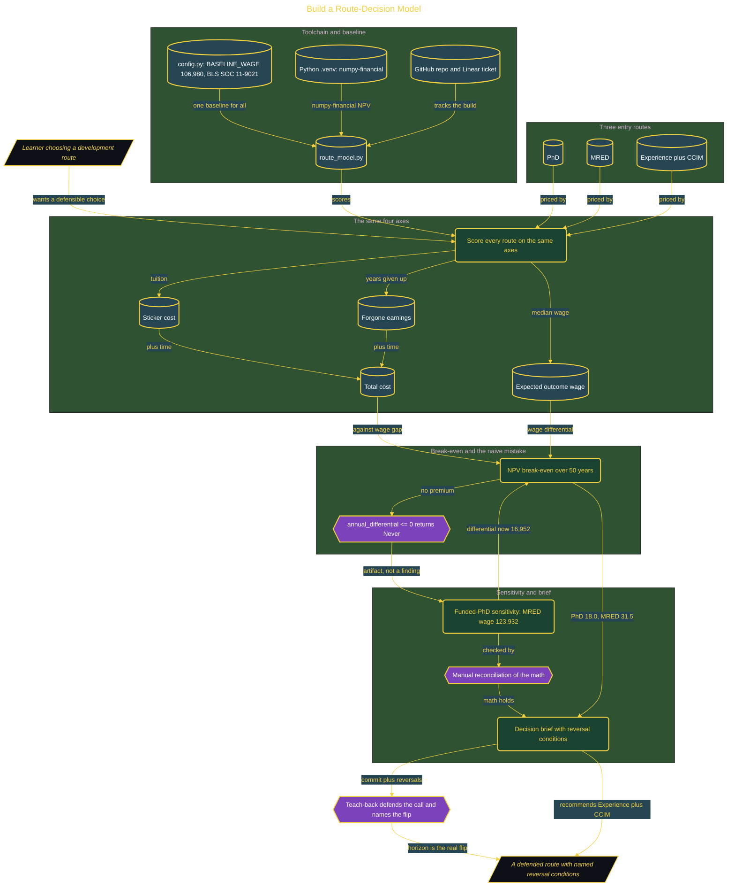

# Build a Route-Decision Model

> Inside the [Mastery Track: Real Estate Development](../../README.md) portfolio · *A hands-on route from amateur to command in real estate development, one end-to-end build at a time.*

## Overview

This build turns a career-route decision into a reproducible financial model. It compares three real estate development entry routes, a PhD, an MRED, and an Experience-plus-CCIM path, on the same four axes: sticker cost, forgone earnings, total cost, and expected outcome wage. The recommendation comes from stated assumptions in code, not gut feeling, and every route is scored against one baseline wage, the BLS May 2024 median for Construction Managers (SOC 11-9021).

The model prices time, not just tuition. Once forgone earnings are counted, the MRED becomes the cheapest route to a development role despite the highest sticker price, because tuition is a one-time cost while lost wages accumulate each year. A break-even calculator over a 50-year horizon exposed a modeling artifact: when a route had no wage premium over the baseline, it returned Never before the NPV loop even ran. A funded-PhD sensitivity pass changed the MRED outcome wage and moved it off Never, and a decision brief committed to a route while naming exactly what would reverse it.

This is one build on the route to command of real estate development. It ships a Python model with numpy-financial NPV, a manual reconciliation check, a decision brief with reversal conditions, and a teach-back that defends the call rather than only checking the numbers.

## Architecture

The diagram shows the topology and data flow of the system as built. The full architectural narrative, with screenshots and prose, lives in [`documents/route-decision-model.md`](./documents/route-decision-model.md).

## Implementation

This system is built across **7 phases**:

1. Building a Route-Decision Model for Real Estate Development
2. Loading Published Data and Establishing the Baseline
3. Scoring All Three Routes on the Same Four Axes
4. Discovering the Naive Mistake: When Nothing Ever Pays Back
5. Flipping the Recommendation: Sensitivity Analysis and the Decision Brief
6. Documenting the Model: Topology, Guide, and Walkthrough
7. Proving Mastery: The Teach-Back Instrument

For the full walkthrough with screenshots and step-by-step content, see [`documents/route-decision-model.md`](./documents/route-decision-model.md).

## Validation

Each build phase below is documented in [`documents/route-decision-model.md`](./documents/route-decision-model.md), with screenshots, configuration, and notes as captured during the build:

- ✅ Building a Route-Decision Model for Real Estate Development
- ✅ Loading Published Data and Establishing the Baseline
- ✅ Scoring All Three Routes on the Same Four Axes
- ✅ Discovering the Naive Mistake: When Nothing Ever Pays Back
- ✅ Flipping the Recommendation: Sensitivity Analysis and the Decision Brief
- ✅ Documenting the Model: Topology, Guide, and Walkthrough
- ✅ Proving Mastery: The Teach-Back Instrument
