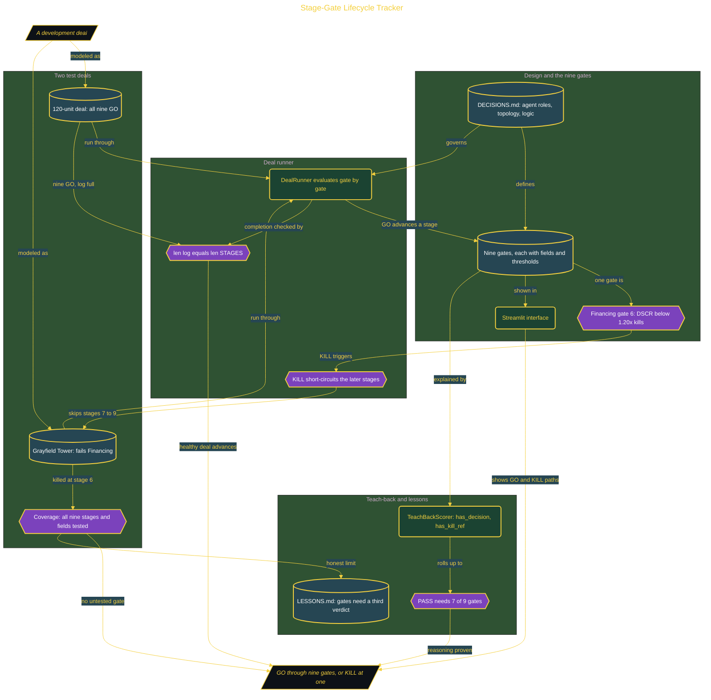

# Build a Stage-Gate Lifecycle Tracker

> Inside the [Mastery Track: Real Estate Development](../../README.md) portfolio · *A hands-on route from amateur to command in real estate development, one end-to-end build at a time.*

## Overview

This build turns the nine real estate development gates into a working decision system, not a static framework. Each of the nine lifecycle stages becomes a gate with fields, thresholds, and a clear GO or KILL outcome that code can evaluate. A stage-gate system is only useful when it can stop a bad deal, so the whole build is organized around proving the tracker kills, not just advances.

The tracker runs a deal through the gates in order and short-circuits on a KILL, the way real development works: a deal that fails Entitlement never reaches Construction. Two deals prove it. A healthy 120-unit deal returns GO across all nine gates, and a broken deal, Grayfield Tower, is engineered to fail the Financing gate (DSCR below 1.20x) at stage 6, which stops stages 7 through 9 from ever evaluating. The negative test is the real proof: a gate that never kills is not a gate.

This is one build on the route to command of real estate development. It ships a Streamlit interface, a DealRunner with short-circuit logic, a coverage checker over all nine stages, a TeachBackScorer, and an honest LESSONS.md that flags where GO and KILL are too limited (Construction and Disposition need a third verdict).

## Architecture

The diagram shows the topology and data flow of the system as built. The full architectural narrative, with screenshots and prose, lives in [`documents/stage-gate-lifecycle-tracker.md`](./documents/stage-gate-lifecycle-tracker.md).

## Agents and automation

The tracker is an agent system. Each agent owns one job and automates one part of the gate discipline:

- **DealRunner** (the core automation)
  - Runs a deal through the nine gates in order, applying each gate's fields and thresholds.
  - Returns a GO or KILL verdict at every gate, so each stage has a testable outcome instead of a description.
  - Short-circuits on the first KILL, so stages after the failure never evaluate, and confirms completion with `len(log) == len(STAGES)` rather than trusting an all-GO log.
- **TeachBackScorer**
  - Scores a learner's explanation of each gate against two checks: `has_decision` (a decision word such as go, kill, or advance) and `has_kill_ref` (the first words of that gate's kill trigger).
  - Returns PASS, PARTIAL, or FAIL per gate, where PARTIAL means a decision was named but the kill trigger was not referenced.
  - Rolls the per-gate results into an overall score, where PASS requires at least 7 of the 9 gates.
- **Coverage checker**
  - Verifies that all nine stages and their required fields are represented in the tests.
  - Blocks a green test run that quietly left a lifecycle stage or a required field untested.
  - Keeps both the passing and the broken deal honest, so neither hides an untested gate.
- **Streamlit tracker interface**
  - Renders the nine-gate lifecycle as a visible interface over the same gate rules.
  - Runs both the passing 120-unit deal and the broken Grayfield Tower deal through one tracker.
  - Shows both paths in one place: a full GO advance and a controlled KILL at the Financing gate.

## Implementation

This system is built across **4 phases**:

1. Designing the Agent System and Encoding Nine Gates
2. Proving the Tracker Advances a Good Deal
3. Proving the Tracker Stops a Broken Deal
4. Teaching Back, Mapping the Architecture, and Shipping the Guide

For the full walkthrough with screenshots and step-by-step content, see [`documents/stage-gate-lifecycle-tracker.md`](./documents/stage-gate-lifecycle-tracker.md).

## Validation

Each build phase below is documented in [`documents/stage-gate-lifecycle-tracker.md`](./documents/stage-gate-lifecycle-tracker.md), with screenshots, configuration, and notes as captured during the build:

- ✅ Designing the Agent System and Encoding Nine Gates
- ✅ Proving the Tracker Advances a Good Deal
- ✅ Proving the Tracker Stops a Broken Deal
- ✅ Teaching Back, Mapping the Architecture, and Shipping the Guide
